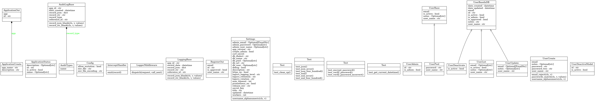

Python:

<a href="https://github.com/psf/black">

CI/CD Pipeline:

<!--  -->
<!--  -->

SonarCloud:

# Backend-Services-API

Work in progress and not ready for production.

## Objective
- User Management
- Authentication via Token
    - [x] POST Login
    - [x] POST register
    - [x] GET Auth Me
- Users
    - [x] GET List all users
    - [x] GET Count all users
    - [x] GET user ID
    - [x] Post Create User
    - [x] POST Check Password
    - [x] PUT User Status
    - [x] PUT Set User as Admin (Ad)
    - [x] DELETE User ID (Admin Only)
- Health Endpoints (somthing like Spring Actuator)
    - [x] Health
    - [x] Config secure via Authentication
- Tools API
 - [x] XML to JSON
 - [x] JSON to XML

### UML
